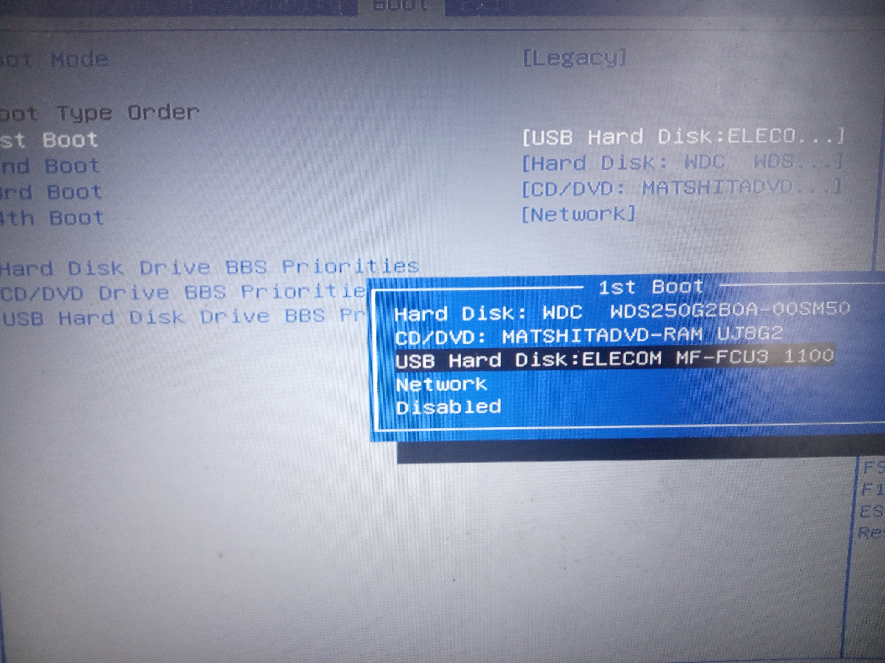
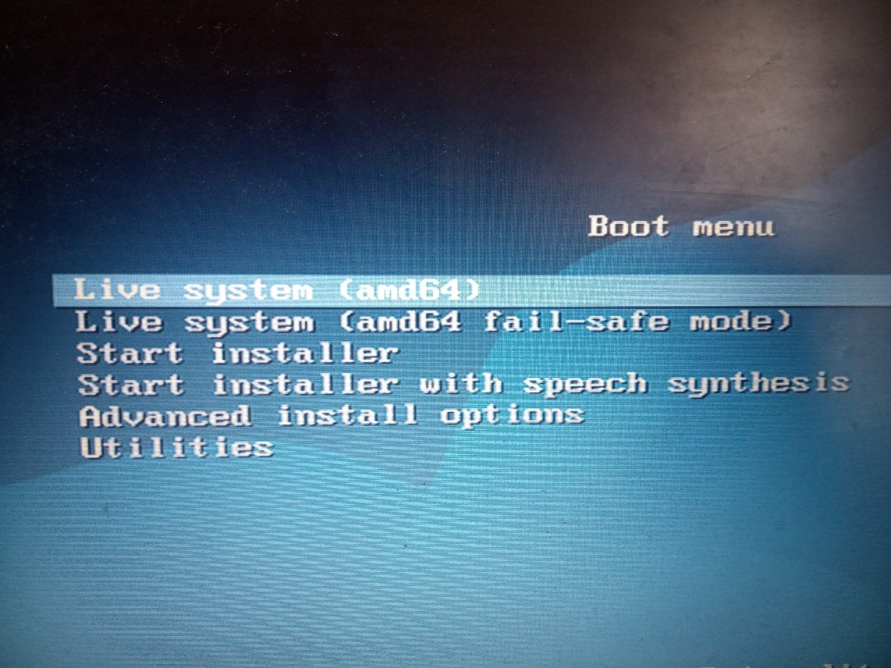
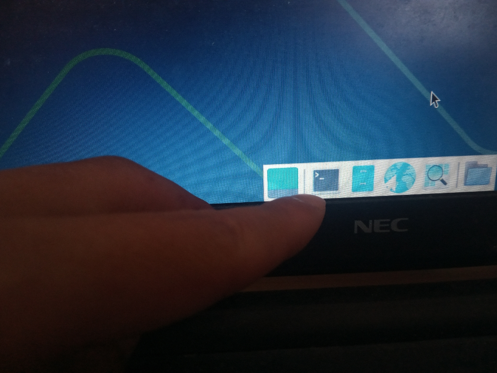
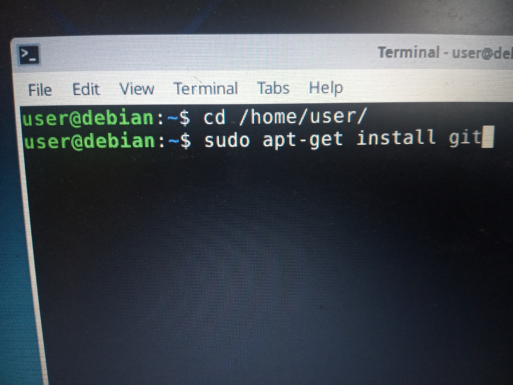

# danny-pojang

### 우선 해야 하는 일 
##### Windows를 사용하시면... 
- https://www.debian.org/CD/live/ 에서 다음 ISO 파일을 다운로드하시고, 
  - https://cdimage.debian.org/debian-cd/current-live/amd64/iso-hybrid/debian-live-13.4.0-amd64-xfce.iso
-  YUMI( https://pendrivelinux.com/yumi-multiboot-usb-creator/ )나 사용해서 준비해 주세요. 공식 문서는 YUMI 대신에 balenaEtcher( https://etcher.balena.io/ )나 USBImager( https://bztsrc.gitlab.io/usbimager/ )를 사용하라 하고 있으니 이가 좋을지도 모릅니다. 

##### Live USB로 PC를 기동힙니다. 
- BIOS 설정이 필요할 수도. 
- 
- 
- 
- 
- Terminal App를 여시고... 
```shell
cd /home/user
sudo apt-get install git
git clone https://github.com/anissatta/danny-pojang.git
cd danny-pojang
sh ./init.sh
```
