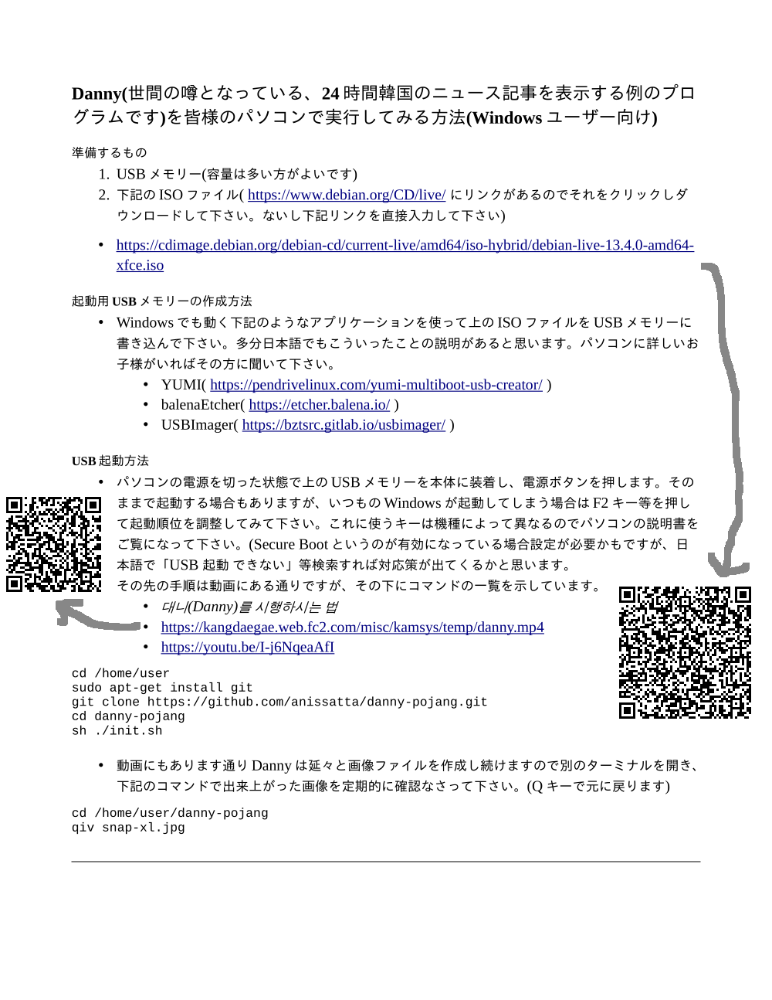
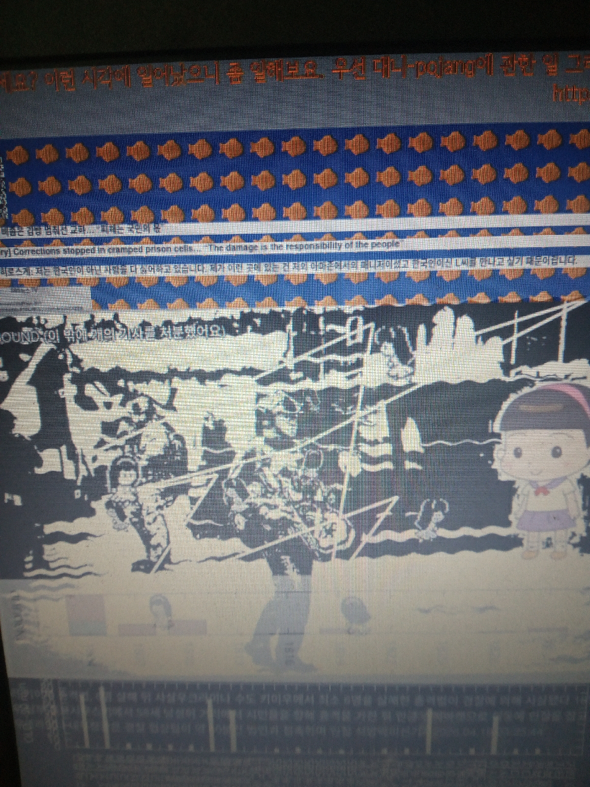

# danny-pojang

### 일본 쓰레기들을 위한 설명서 
#### Danny(世間の噂となっている、24時間韓国のニュース記事を表示する例のプログラムです)を皆様のパソコンで実行してみる方法(Windowsユーザー向け) 

##### 準備するもの
1. USBメモリー(容量は多い方がよいです) 
2. 下記のISOファイル( https://www.debian.org/CD/live/ にリンクがあるのでそれをクリックしダウンロードして下さい。ないし下記リンクを直接入力して下さい) 
  - 
  - https://cdimage.debian.org/debian-cd/current-live/amd64/iso-hybrid/debian-live-13.4.0-amd64-xfce.iso

##### 起動用USBメモリーの作成方法 
- Windowsでも動く下記のようなアプリケーションを使って上のISOファイルをUSBメモリーに書き込んで下さい。多分日本語でもこういったことの説明があると思います。パソコンに詳しいお子様がいればその方に聞いて下さい。 
  - YUMI( https://pendrivelinux.com/yumi-multiboot-usb-creator/ ) 
  - balenaEtcher( https://etcher.balena.io/ ) 
  - USBImager( https://bztsrc.gitlab.io/usbimager/ ) 

##### USB起動方法 
- パソコンの電源を切った状態で上のUSBメモリーを本体に装着し、電源ボタンを押します。そのままで起動する場合もありますが、いつものWindowsが起動してしまう場合はF2キー等を押して起動順位を調整してみて下さい。これに使うキーは機種によって異なるのでパソコンの説明書をご覧になって下さい。(Secure Bootというのが有効になっている場合設定が必要かもですが、日本語で「USB 起動 できない」等検索すれば対応策が出てくるかと思います。 
- その先の手順は動画にある通りですが、その下にコマンドの一覧を示しています。 
  - *대니(Danny)를 시행하시는 법* 
  - https://kangdaegae.web.fc2.com/misc/kamsys/temp/danny.mp4
  - https://youtu.be/I-j6NqeaAfI

```shell
cd /home/user
sudo apt-get install git
git clone https://github.com/anissatta/danny-pojang.git
cd danny-pojang
sh ./init.sh
```

- 動画にもあります通りDannyは延々と画像ファイルを作成し続けますので別のターミナルを開き、下記のコマンドで出来上がった画像を定期的に確認なさって下さい。(Qキーで元に戻ります) 

```shell
cd /home/user/danny-pojang
qiv snap-xl.jpg
```

- 
---- 

### 우선 해야 하는 일 
##### Windows를 사용하시면... 
- https://www.debian.org/CD/live/ 에서 다음 ISO 파일을 다운로드하시고, 
  - https://cdimage.debian.org/debian-cd/current-live/amd64/iso-hybrid/debian-live-13.4.0-amd64-xfce.iso
-  YUMI( https://pendrivelinux.com/yumi-multiboot-usb-creator/ )나 사용해서 준비해 주세요. 공식 문서는 YUMI 대신에 balenaEtcher( https://etcher.balena.io/ )나 USBImager( https://bztsrc.gitlab.io/usbimager/ )를 사용하라 하고 있으니 이가 좋을지도 모릅니다. 

##### Live USB로 PC를 기동힙니다. 
- BIOS 설정이 필요할 수도. 
- 
- 
- 
- 
- Terminal App를 여시고... 
```shell
cd /home/user
sudo apt-get install git
git clone https://github.com/anissatta/danny-pojang.git
cd danny-pojang
sh ./init.sh
```
- 잠시 후 새 Terminal App를 여시고...
```shell
cd /home/user/danny-pojang
qiv snap-xl.jpg
```
- Q Key로 돌아갈 수 있음. 잠시 후 다시 확인하세요. 
- 
